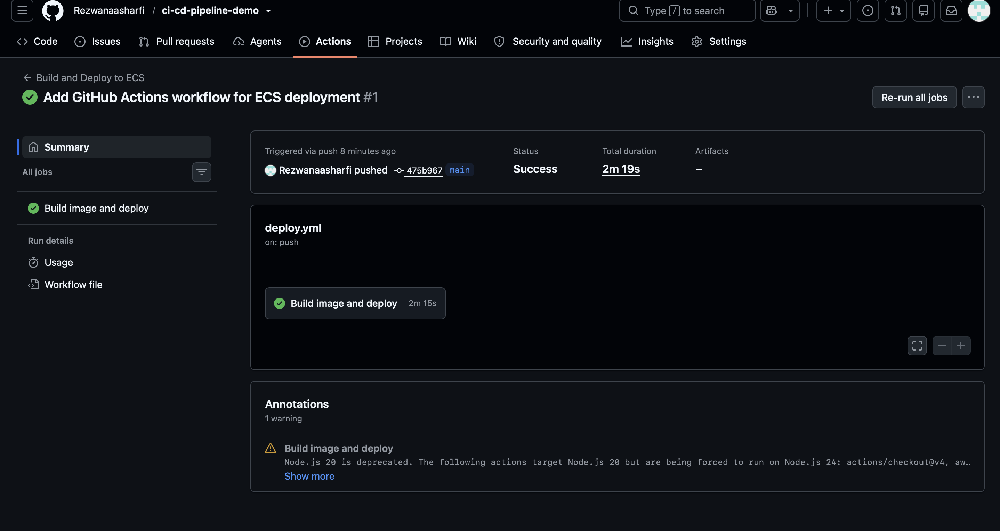
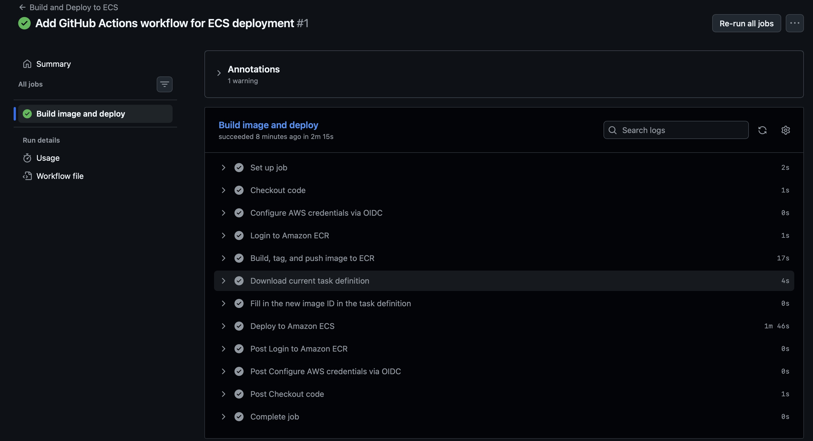
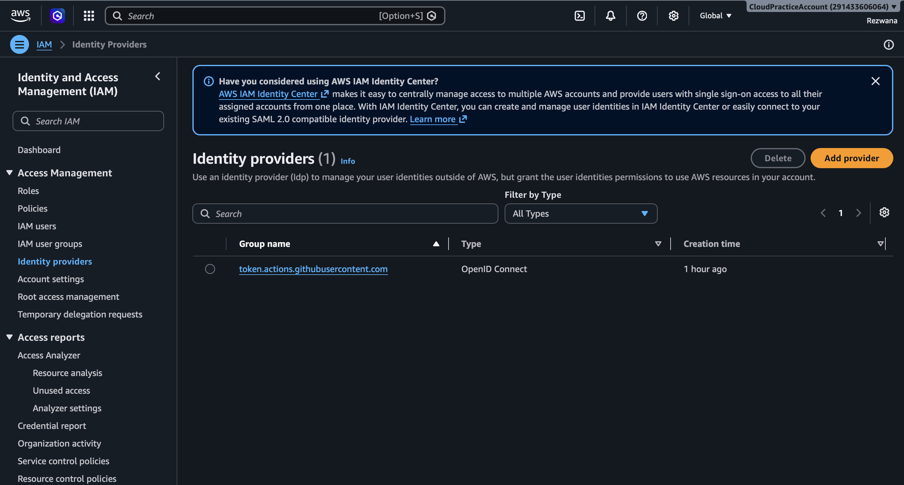
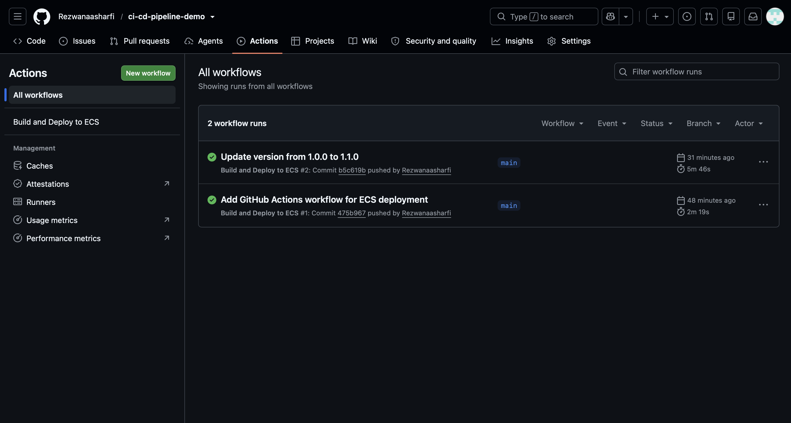
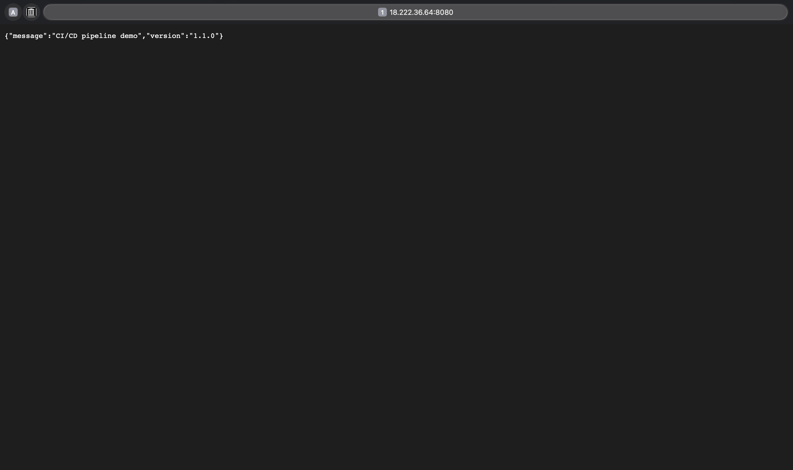
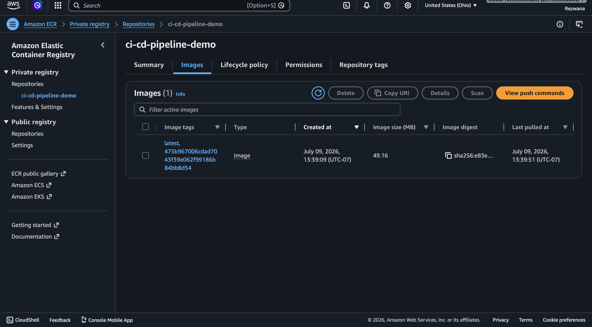
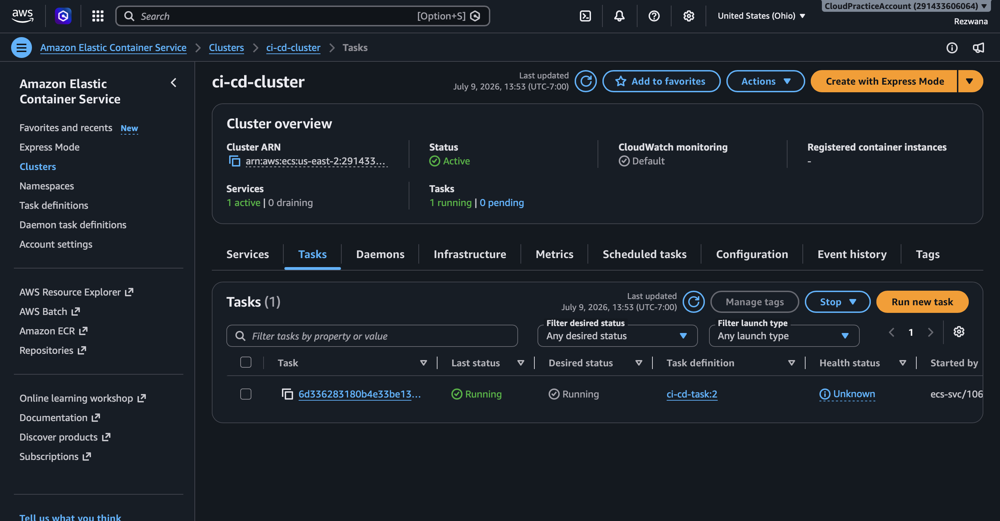
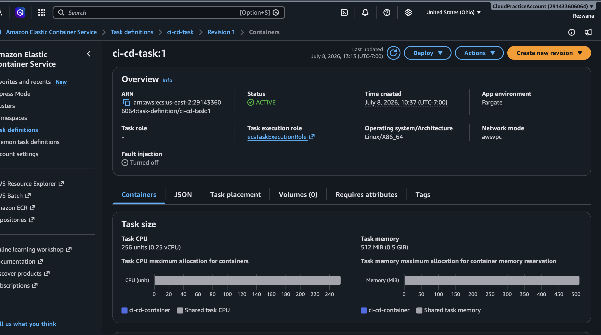

# CI/CD Pipeline — Containerized App on ECS Fargate

An automated pipeline that takes a code push to GitHub and ships it to production with zero manual steps.

**Flow:** `git push` → GitHub Actions → build Docker image → push to Amazon ECR → rolling deploy to Amazon ECS Fargate

## Stack

| Layer | Service |
|---|---|
| **Application** | Python 3.12 + Flask |
| **Container** | Docker |
| **Registry** | Amazon ECR (private) |
| **Compute** | Amazon ECS on AWS Fargate (serverless containers) |
| **CI/CD** | GitHub Actions |
| **Auth** | IAM role assumed via GitHub OIDC — no stored AWS keys |
| **Region** | us-east-2 (Ohio) |

## How it works

Every push to `main` triggers `.github/workflows/deploy.yml`:

1. **Checkout** the repository
2. **Authenticate to AWS via OIDC** — GitHub presents a short-lived identity token; AWS verifies it and returns temporary credentials. No access keys are stored anywhere.
3. **Build the Docker image** from the `Dockerfile` and tag it with the commit SHA
4. **Push to Amazon ECR** (both `:latest` and the immutable SHA tag)
5. **Register a new ECS task definition revision** pointing at the new image
6. **Deploy to ECS Fargate** with a rolling update, waiting for the service to reach a stable state

## Security: keyless authentication with OIDC

Rather than storing long-lived AWS access keys as GitHub secrets, this pipeline uses **OpenID Connect federation**. An IAM OIDC identity provider trusts `token.actions.githubusercontent.com`, and a scoped IAM role (`github-actions-ci-cd-role`) can only be assumed by workflows running in this specific repository.

The role carries least-privilege permissions: ECR push/pull, a narrow set of ECS actions, and `iam:PassRole` scoped to the single task execution role.

## Demo: continuous deployment in action

The app serves a version string. Changing one line in `app.py` and committing is the entire deployment process.

**Before** — `VERSION = "1.0.0"`

Commit the version bump. The pipeline builds, pushes, and redeploys automatically:

**After** — the running task is replaced and now serves `1.1.0`:

## Infrastructure

**Amazon ECR** holds the container images, tagged by commit SHA for traceability:

**Amazon ECS** runs the container on Fargate — 0.25 vCPU, 0.5 GB memory, `awsvpc` networking, public IP assigned:

## Repository structure
